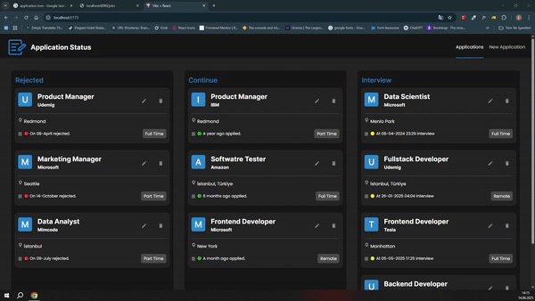

# 🚀 Job Tracker App
A powerful and clean Job Tracker application built using **React**, **Redux Toolkit**, and **Vite**. This project allows users to track job applications, manage interview statuses, and stay organized in their job hunt journey. 🎯

---

## 🛠️ Technologies Used
- ⚛️ **React** – UI Library
- 🎯 **Redux Toolkit** – State Management
- ⚡ **Vite** – Fast build tool
- 🎨 **SCSS** – Styling
- 🌐 **Day.js** – Date formatting
- 🔁 **Axios/Fetch** – API handling (if used in apis/)
- 🧪 **React Dev Tools** – Development Debugging

---

## ✨ Features
- 📌 Add and manage job applications
- 🔄 Update job statuses (Continue, Interview, Rejected)
- 📅 Track interview and rejection dates
- 🔍 Sort jobs
- 🧩 Reusable components with clean structure
- 💾 LocalStorage or API integration supported

---

## GitHub Link
https://tinyurl.com/2j9r7aku

---

## 👀 Preview
